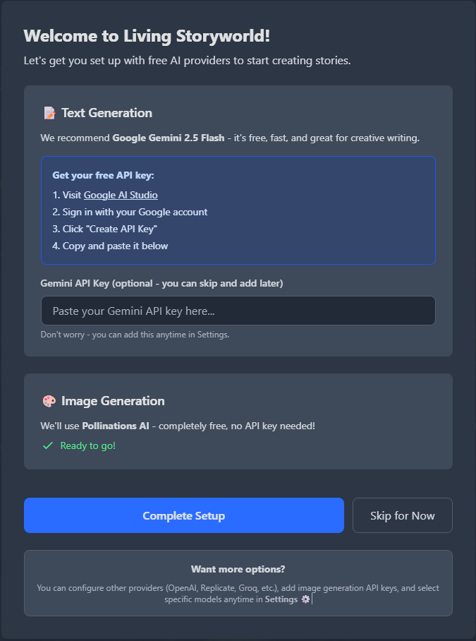
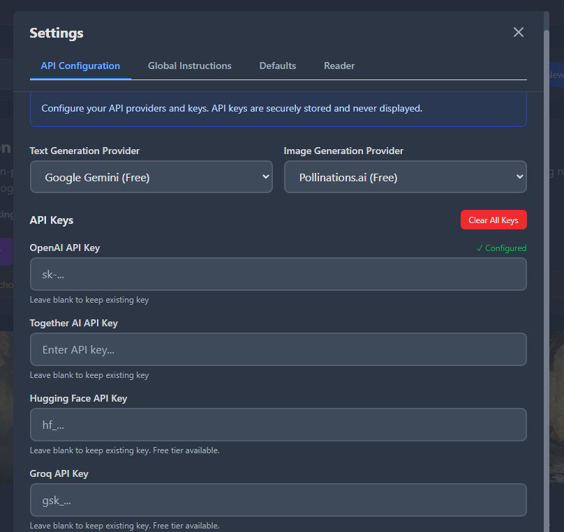
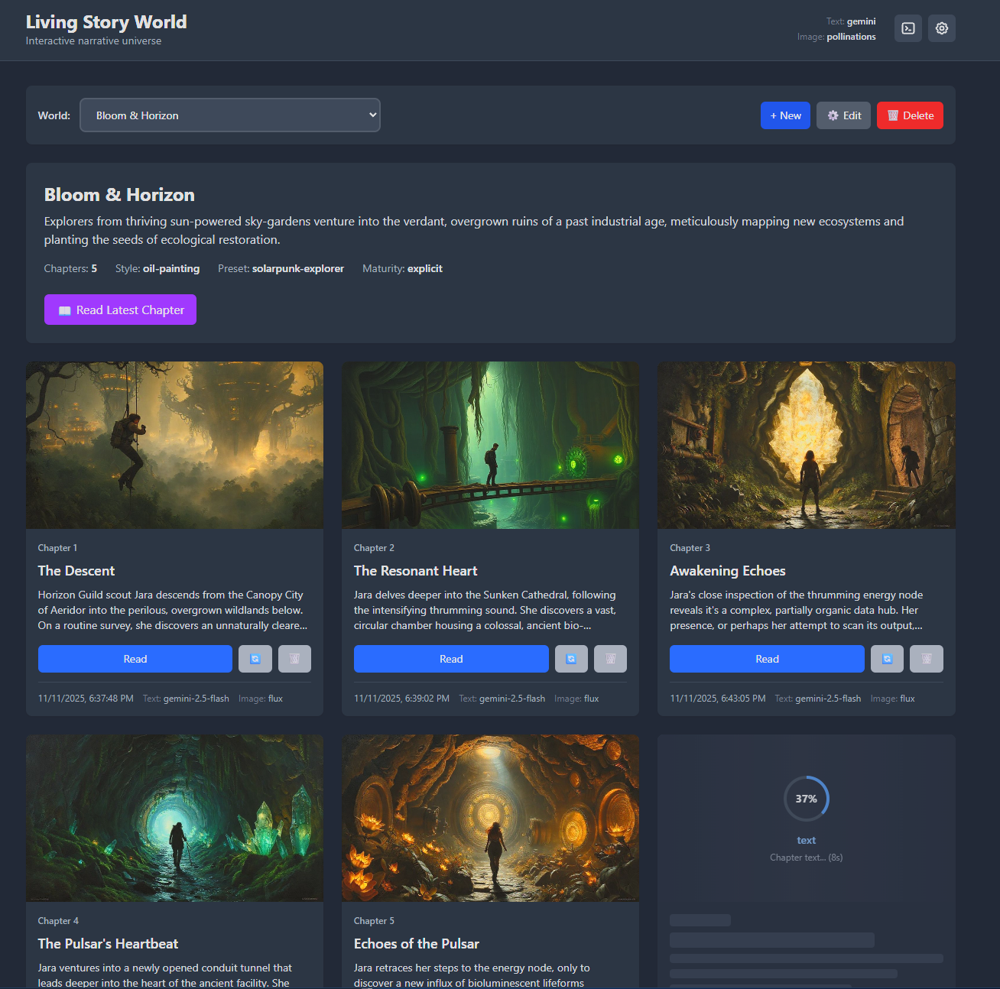
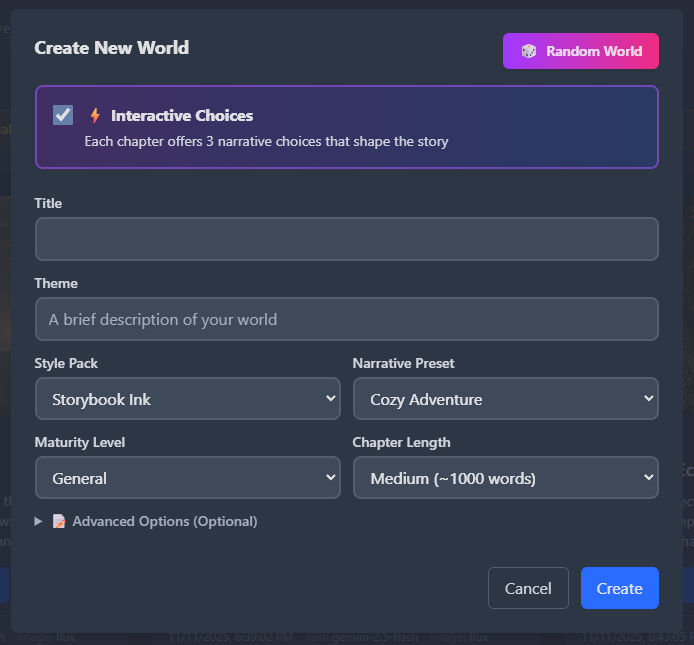
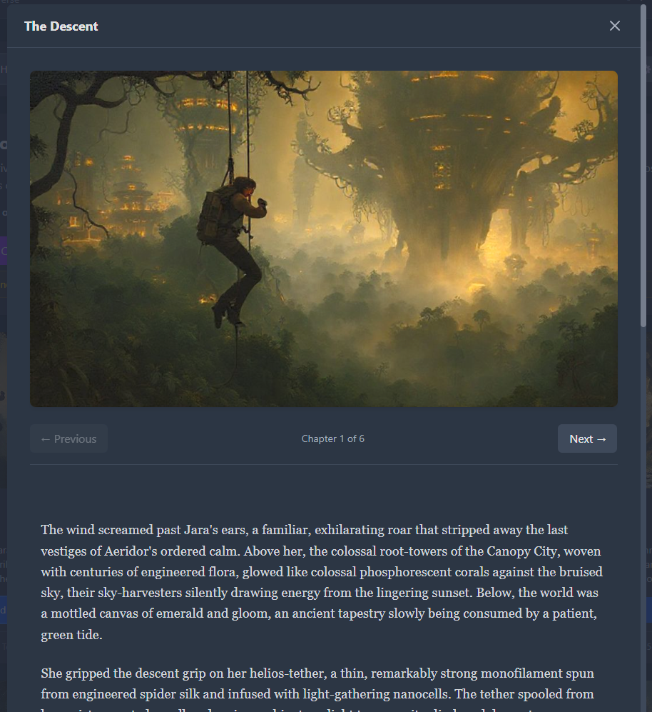
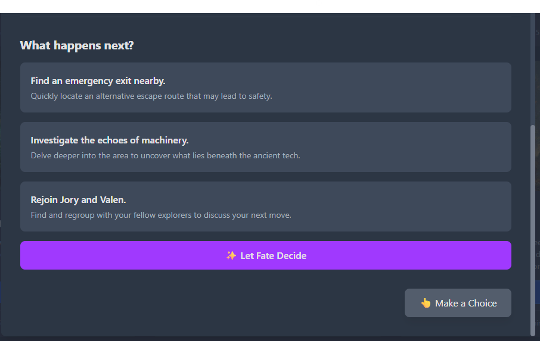

# Living Storyworld

[](https://github.com/jonmartin721/living-story-world/releases)
[](https://github.com/jonmartin721/living-story-world/actions)
[](https://www.python.org/downloads/)
[](LICENSE)
[](https://github.com/astral-sh/ruff)

>NovelAI but chill

Living Storyworld is a story generator that creates illustrated stories chapter by chapter. Each story builds on previous chapters, maintaining character and location continuity while letting you make choices that affect the narrative going forward!

The project started as an experiment in combining modern AI models with classic text adventure mechanics. I wanted to see if we could have the narrative depth of a novel without requiring the creative effort that services like NovelAI demand from users. 

---

## Features

- Stories remember characters and locations across chapters
- Works with multiple AI providers (OpenAI, Groq, Together AI, etc.) for both text and images
- Several visual styles for story illustrations
- Genre presets for different story types (fantasy, mystery, sci-fi, etc.)
- Web interface for managing worlds and generating chapters
- Image caching to avoid redundant API calls
- Random world generation with pre-built lore
---

## Quick Start

I highly recommend downloading pre-built executables from the [Releases](https://github.com/jonmartin721/living-storyworld/releases) 

If you'd really like to build it or contribute, run from source:

```bash
git clone https://github.com/jonmartin721/living-storyworld.git
cd living-storyworld
python3 -m venv .venv
source .venv/bin/activate
pip install -r requirements.txt

# Start the web interface
python3 -m living_storyworld.cli web
```

The web app will open at `http://localhost:8001`. First-time setup will walk you through configuring API keys - I recommend using Gemini (free tier) plus Pollinations for images to get started without costs.



Once you're in, create a new world by clicking "New" (or use the random generator) and start generating chapters. You can make choices at key points to steer the story direction.

## Interface & Workflow

### 1. First-Time Setup

When you first launch Living Storyworld, you'll see a setup wizard that guides you through configuring your API keys. You'll need at least one text provider (we recommend Gemini's free tier) and optionally an image provider (Pollinations is free and requires no key).


You can always return to settings later to add more providers or change your defaults:



### 2. World Management

The main interface shows all your story worlds in one place. Each world card displays recent chapters with their illustrations, making it easy to jump back into any story.



### 3. Creating a New World

Click "New World" to start a fresh story. You can manually set the title, theme, genre, and art style, or use the random generator to create unique combinations instantly!



### 4. Reading & Making Choices

When reading chapters, you'll get a simple and distraction-free view optimized for enjoying your generated story. The interface shows the chapter illustration, narrative text, and your choices.



At key moments in the story, you'll be presented with choices that influence how the narrative unfolds. Select an option to guide the direction of the next chapter.

These are PERMANENT! Choose carefully.



---

## Visual Styles
These affect how images generated look to a very high degree.

Available illustration styles:
- `storybook-ink` - Ink and wash illustrations
- `pixel-rpg` - 16-bit pixel art style
- `lowpoly-iso` - Isometric low-poly scenes
- `watercolor-dream` - Soft watercolor paintings
- `noir-sketch` - High contrast ink drawings
- `art-nouveau` - Art Nouveau poster style
- `comic-book` - Classic comic book look
- `oil-painting` - Classical oil paintings

---

## Narrative Presets
These affect pacing, how the story is told, maturity level, and random world generation. These have a large effect on your story!

Story genres to set the tone:
- `cozy-adventure` - Character-driven stories with gentle stakes
- `epic-fantasy` - High fantasy with kingdoms, magic, and large conflicts
- `solarpunk-explorer` - Hopeful eco-futurism and community building
- `whimsical-fairy-tale` - Modern fairy tales with charm and moral elements
- `noir-mystery` - Urban crime stories with cynical detectives
- `gothic-horror` - Atmospheric horror with family secrets and dread
- `cosmic-horror` - Existential stories about incomprehensible forces
- `cyberpunk-noir` - Near-future tech noir with corporate intrigue
- `slice-of-life` - Everyday moments and character relationships
- `historical-intrigue` - Period stories with political maneuvering
- `post-apocalyptic` - Survival and rebuilding after societal collapse
- `space-opera` - Grand interstellar adventures

---

## Architecture

The project uses FastAPI for the web backend with a plugin system for different AI providers. Each world is stored as JSON files with markdown chapters and PNG illustrations. The system tracks character and location state across chapters to maintain narrative consistency.

---

## API Keys & Setup

I recommend using Gemini 2.5 Flash (free tier available) with Pollinations for images to get started for free!. 
Get a key here: https://aistudio.google.com/api-keys for a free tier API key.

The setup wizard will walk you through this configuration. You MUST use an API key for a text provider, unlike Pollinations.ai there is no free generations without an API key. You can skip that step, but text won't generate until you provide an API key.

**Security notes:**
- API keys are stored locally with restricted permissions
- The web server runs on localhost only
- No authentication is built-in (don't expose this to the internet)
- Basic security measures are in place for file operations

---

## Contributing

Contributions are welcome! See [CONTRIBUTING.md](CONTRIBUTING.md) for guidelines on how to get started.

**Found a bug?** Please [open an issue](https://github.com/jonmartin721/living-story-world/issues) on GitHub.

Enjoy!

---

## License

This project is licensed under the MIT License — see [LICENSE](LICENSE) for details.