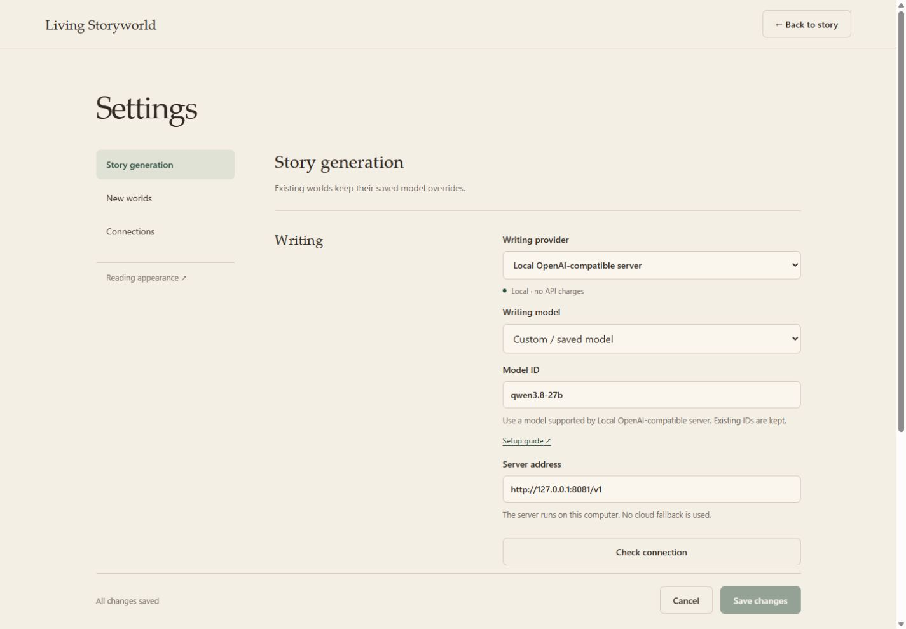
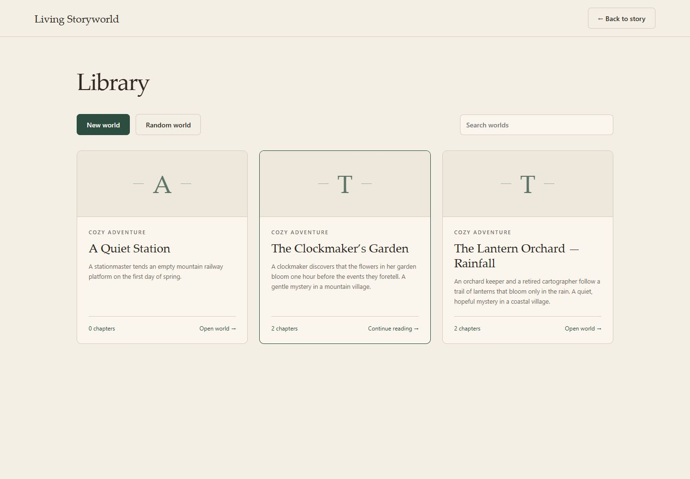
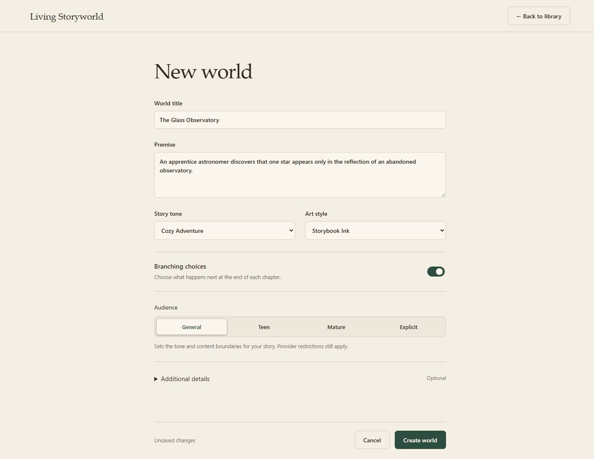
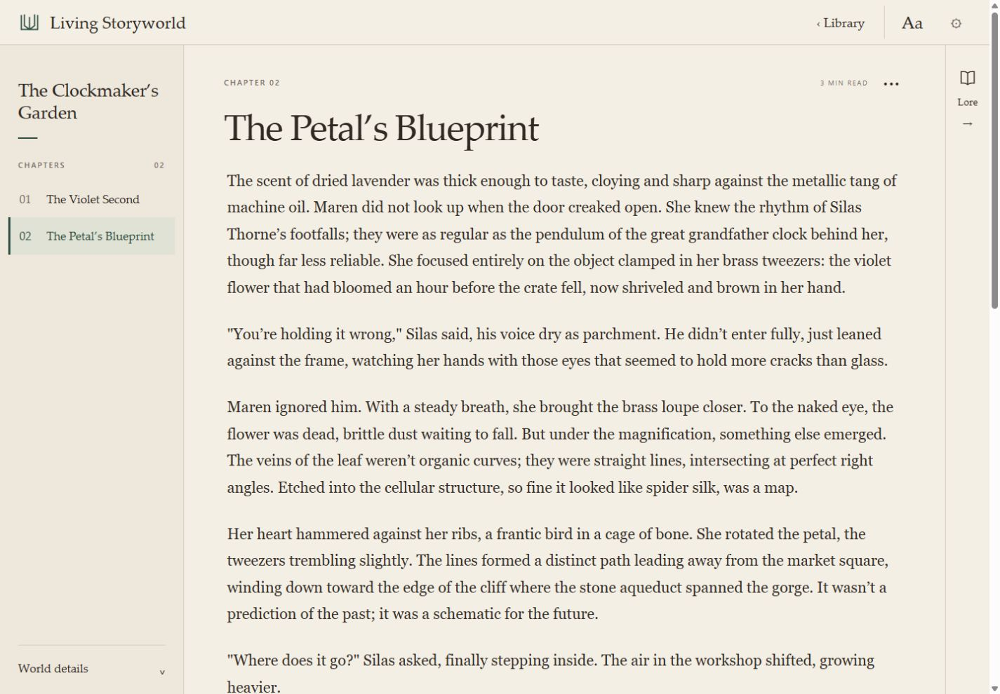
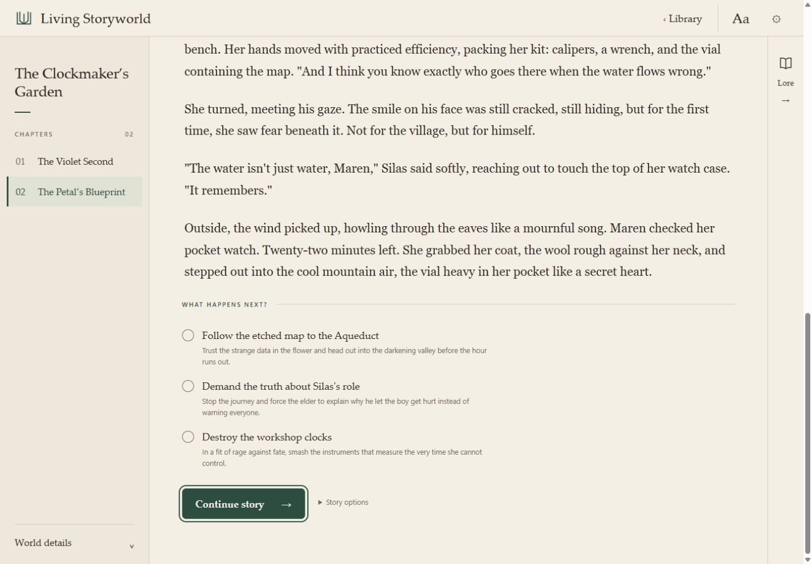

# Living Storyworld

[](https://github.com/jonmartin721/living-story-world/releases)
[](https://github.com/jonmartin721/living-story-world/actions)
[](https://codecov.io/gh/jonmartin721/living-story-world)
[](https://www.python.org/downloads/)
[](LICENSE)
[](https://github.com/astral-sh/ruff)

>NovelAI but chill

An AI storytelling engine that writes illustrated chapters while maintaining memory. Characters remember past events, locations build history, and your choices actually matter going forward.

I built this to explore whether AI could handle long-form narrative without turning into word salad by Chapter 3. The interesting engineering problems: keeping a knowledge graph consistent across generations, orchestrating multiple AI providers (text + image) with clean abstractions, and streaming progress in real-time without blocking the UI.

**Built with:** Python, FastAPI, Server-Sent Events, NovelAI-style memory system

---

## Why I Built This

Most AI story generators are goldfish—write one scene, forget everything, write another. I wanted to see if we could maintain a persistent narrative universe where entities (characters, locations, plot threads) survive across generations instead of getting amnesia every chapter.

The project started as an experiment in combining modern AI models with classic text adventure mechanics. Could we have the narrative depth of a novel without requiring the creative effort that services like NovelAI demand from users?

Also, I wanted to play with provider-agnostic patterns to avoid vendor lock-in. Being able to A/B test OpenAI vs Groq vs Together AI side-by-side is useful when everyone's releasing new models every week.

---

## Quick Start

I highly recommend downloading pre-built executables from the [Releases](https://github.com/jonmartin721/living-story-world/releases).

If you'd rather build from source or contribute:

```bash
git clone https://github.com/jonmartin721/living-story-world.git
cd living-story-world
python3 -m venv .venv
source .venv/bin/activate
pip install -r requirements.txt
npm install --prefix frontend

# Start the web interface
npm run start
```

To run the full local verification pass from the repo root:

```bash
npm run verify
```

The web app opens at `http://localhost:8001`. New installs use **Ollama for local writing, with illustrations off**. There is no required paid API or subscription.

1. Install [Ollama](https://docs.ollama.com/quickstart) and download a model that fits your hardware.
2. Open **Settings → Story generation**, select Ollama, and click **Check connection**. Choose an installed model and save.
3. Open **Library → New world**. Add a title and premise, then begin the story.

Already running LM Studio, vLLM, llama.cpp, or NInfer? Choose **Local OpenAI-compatible server**, enter its loopback URL (including `/v1`), and check the connection. Reasoning defaults to off for faster storytelling; choose **Use server default** if your runtime does not support that parameter. Local generation never falls back to a cloud service. Hardware, electricity, and model licenses are still your responsibility.

For hosted generation, [Gemini](https://ai.google.dev/gemini-api/docs/pricing) and [Groq](https://console.groq.com/docs/rate-limits) offer quota-limited free tiers that require keys. OpenRouter also offers a free models router. Paid providers are optional and labeled in Settings. Generation stays on your selected provider, even when another key is saved. For free illustrations, choose **AI Horde** with a free account key. Community queues can be slow; requests time out after five minutes. Prompts go to volunteer workers. Anonymous keys are not supported because anonymous images are shared with a dataset.

For local illustrations, choose **ComfyUI**. Start ComfyUI, import an **API-format** workflow in Settings, and select its positive text prompt node. The app replaces that prompt and randomizes seeds, while preserving your model and image dimensions. Use local model nodes (for example Z-Image Turbo or FLUX Schnell); ComfyUI's cloud API nodes can incur charges. This connection needs a working workflow with a Save Image node.

Pollinations now requires authentication and credits; it is no longer a keyless image fallback.

---

## Interface & Workflow

### 1. First-Time Setup

Open Settings to choose generation services, set defaults for new worlds, or manage connections. Reading appearance lives beside the story: four themes, three typefaces, and four text sizes apply immediately.



### 2. World Management

The main interface shows all your story worlds in one place. Search by title or premise, see chapter counts, and return to a story from its card.



### 3. Creating a New World

Click "New world" to set a title, premise, story tone, art style, audience, and branching choices. Additional details let you add lore and model overrides. "Random world" in the library generates a starting point you can edit before saving.



### 4. Reading & Making Choices

The reader shows chapter text, choices when enabled, and an illustration when one has been generated. Chapter navigation, lore, and reading appearance are available beside the story.



At key moments in the story, you'll be presented with choices that influence how the narrative unfolds. Select an option to guide the direction of the next chapter.

You can change the latest chapter's choice until you generate the next chapter. Earlier chapters keep their established choices.



---

## Features

- **Persistent Memory** - Stories remember characters and locations across chapters (entity graph tracks continuity)
- **Multi-Provider Support** - Use Ollama or a local OpenAI-compatible server, or choose a hosted text and image provider in Settings
- **Visual Styles** - 8 illustration styles from storybook ink to pixel art to oil paintings
- **Genre Presets** - 12 narrative presets tuned for different story types (fantasy, mystery, sci-fi, horror, etc.)
- **Real-Time Progress** - Server-Sent Events with status polling to recover from a dropped connection
- **Choice System** - Choose the next chapter's direction, with changes allowed while it is still the latest chapter
- **Image Caching** - Avoids redundant API calls by hashing prompts
- **Random Worlds** - Generator creates unique world combinations with pre-built lore
- **Web + TUI + CLI** - Three interfaces (browser, terminal UI, command-line)

---

## How It Works

### Provider Swapping

One design goal: don't get locked into a single AI provider. OpenAI might be expensive, Groq might be fast, Together AI might have a better model next month.

Text providers share a synchronous interface: pass chat messages to `generate()` and receive a `TextGenerationResult` with content, provider, model, and an estimated cost. For example, to use the provider and model selected in Settings:

```python
from living_storyworld.providers import get_text_provider
from living_storyworld.settings import get_api_key_for_provider, load_user_settings

settings = load_user_settings()
provider = get_text_provider(
    settings.text_provider,
    api_key=get_api_key_for_provider(settings.text_provider, settings),
)
result = provider.generate(
    [{"role": "user", "content": "Write an opening scene in a clockmaker's workshop."}],
    model=settings.default_text_model or None,
)
print(result.content)
```

Now I can A/B test providers side-by-side or switch when one goes down. Currently supports: Ollama, local OpenAI-compatible servers, OpenAI, Groq, Together AI, Hugging Face, OpenRouter, and Gemini.

Same pattern for image providers (ComfyUI, AI Horde, OpenAI, Replicate, Hugging Face, Pollinations, and fal.ai).

### State Management & Entity Graph

World state is stored as JSON files with dataclass serialization. Each world tracks:

```
worlds/<slug>/
├── config.json          # WorldConfig (editable title, theme, models, style)
├── world.json           # WorldState (mutable: characters, locations, chapters)
├── chapters/            # Generated markdown content
├── media/
│   ├── scenes/          # Scene illustrations (PNG)
│   └── index.json       # Media metadata registry
└── web/
    └── index.html       # Static HTML export (via build command)
```

Entity extraction happens automatically via structured JSON in chapter metadata:

```html
<!-- {
  "scene_prompt": "...",
  "characters_in_scene": ["char-001"],
  "new_characters": [{"id": "char-002", "name": "...", "description": "..."}],
  "new_locations": [...],
  "summary": "..."
} -->
```

New entities get registered into `WorldState` during generation, building a persistent knowledge graph. This is how the system remembers that "Lyra" is a character and "Thornhaven" is a location across chapters.

### Real-Time Progress Streaming

Chapter generation uses Server-Sent Events for live progress updates, with status polling if the connection drops:

| Request | Response |
| --- | --- |
| `POST /api/worlds/{slug}/chapters` with `{"chapter_length":"medium","no_images":true}` | `{"job_id":"..."}` starts one generation job |
| `GET /api/worlds/{slug}/chapters/stream/{job_id}` | Named SSE events: `progress` carries stage, percent, and message; `complete` carries the chapter; `error` carries `{"error":"..."}` |
| `GET /api/worlds/{slug}/chapters/jobs/{job_id}` | Job status (`running`, `complete`, or `error`) plus progress, chapter, and error fields |

Listen with `addEventListener("progress", ...)` and `addEventListener("complete", ...)`, rather than `onmessage`, because the stream uses named events. The React [useEventStream hook](frontend/src/hooks/useEventStream.ts) handles terminal events and status recovery.

The backend emits structured events during generation. Reconnecting readers receive the latest status or completed chapter without starting another generation. Completed jobs stay in memory for up to 10 minutes (at most 100 results); restarting the server clears that recovery state.

### Memory System (NovelAI-Inspired)

Context is built via layered injection:

1. **Memory** (always included) - World lore, background, key facts
2. **Author's Note** (inserted at strategic point) - Style guidance, tone directives
3. **World Instructions** - Custom world-specific rules
4. **Preset System Directive** - Genre-specific generation guidance
5. **Chapter History** - Recent chapter summaries for continuity
6. **Entity Context** - Active characters and locations in scene

This gives you control over different "levels" of context like NovelAI's lorebooks, but simpler.

---

## Design Decisions

### Why Server-Sent Events instead of WebSockets?

Simpler server implementation and automatic reconnect handling. Generation is unidirectional (server → client), so WebSockets would be overkill. SSE gives you real-time updates without the complexity of bidirectional channels.

### Why dataclasses instead of SQLAlchemy?

JSON persistence keeps the project dependency-light and makes the world files human-readable. For a narrative tool, being able to `cat world.json` and see your entity graph is genuinely useful for debugging. Also avoids the overhead of an ORM for what's essentially a document store.

### Why FastAPI + Textual + PyWebView?

I wanted to build three interfaces (CLI, TUI, web) from one backend. FastAPI's async support made SSE easy, Textual handles the terminal UI, and PyWebView wraps the web interface for a "desktop app" feel without Electron bloat.

### Why multiple providers instead of just OpenAI?

Vendor lock-in sucks. Also, different providers have different strengths—Groq is blazingly fast, Together AI has open models, Gemini has a generous free tier. Being able to compare outputs side-by-side is valuable.

---

## Visual Styles

These affect how generated images look to a very high degree.

Available illustration styles:
- `storybook-ink` - Ink and wash illustrations with subtle color accents
- `pixel-rpg` - 16-bit pixel art style (classic JRPG aesthetic)
- `lowpoly-iso` - Isometric low-poly scenes
- `watercolor-dream` - Soft watercolor paintings with bleeding edges
- `noir-sketch` - High contrast ink drawings (black and white)
- `art-nouveau` - Art Nouveau poster style with flowing lines
- `comic-book` - Classic comic book look with halftone dots
- `oil-painting` - Classical oil paintings with visible brushstrokes

Each style pack includes base prompt, negative prompt, and style modifiers for consistent output.

---

## Narrative Presets

These affect pacing, tone, maturity level, and how the story is told. Large effect on narrative output!

Story genres:
- `cozy-adventure` - Character-driven stories with gentle stakes (think Stardew Valley)
- `epic-fantasy` - High fantasy with kingdoms, magic, and large-scale conflicts
- `solarpunk-explorer` - Hopeful eco-futurism and community building
- `whimsical-fairy-tale` - Modern fairy tales with charm and moral elements
- `noir-mystery` - Urban crime stories with cynical detectives
- `gothic-horror` - Atmospheric horror with family secrets and dread
- `cosmic-horror` - Existential stories about incomprehensible forces (Lovecraftian)
- `cyberpunk-noir` - Near-future tech noir with corporate intrigue
- `slice-of-life` - Everyday moments and character relationships
- `historical-intrigue` - Period stories with political maneuvering
- `post-apocalyptic` - Survival and rebuilding after societal collapse
- `space-opera` - Grand interstellar adventures

Each preset specifies temperature, system instructions, pacing, and content maturity level.

---

## CLI Reference

```bash
# World initialization
python3 -m living_storyworld.cli init \
  --title "World Name" \
  --theme "Theme description" \
  --style storybook-ink

# init inherits the image model from Settings; --image-model overrides it.
# Select a narrative preset when generating a chapter:

# Chapter generation
python3 -m living_storyworld.cli chapter \
  --world world-slug \
  --preset cozy-adventure

# Scene image generation
python3 -m living_storyworld.cli image scene \
  --world world-slug \
  --chapter 1

# Static HTML build (shareable export)
python3 -m living_storyworld.cli build --world world-slug

# Configuration management
python3 -m living_storyworld.cli setup

# Launch web interface
python3 -m living_storyworld.cli web --no-browser --port 8001

# Interactive TUI (terminal interface)
python3 -m living_storyworld.cli play
```

## Frontend Development

The FastAPI app serves built assets from `living_storyworld/web/`, and that directory is generated from the React/Vite app in `frontend/`.

```bash
# Install once
npm install --prefix frontend

# Run frontend tests
npm test --prefix frontend

# Build the production UI into living_storyworld/web/
npm run build --prefix frontend
```

---

## API Keys & Configuration

Local writing needs no cloud key. For optional hosted services, add a key under **Settings → Connections**; the browser only receives key-presence flags. Keys are stored in plain text in `~/.config/living_storyworld/config.json` (or `$XDG_CONFIG_HOME/living_storyworld/config.json`). The app attempts to restrict file permissions, but this is not encrypted credential storage.

If your local OpenAI-compatible server requires a key, save it under Connections or set `LOCAL_API_KEY`. Environment keys take precedence over saved keys for both connection checks and generation.

Existing world and model settings are preserved. To have an older world follow current app defaults, open **Edit world → Additional details** and clear its model overrides. Saved model IDs must match the provider selected in Settings. Retired Gemini models produce an actionable error instead of silently changing the story's model.

### Security Notes

This runs on localhost only by default (`127.0.0.1`). Don't expose it to the internet—there's no authentication, no rate limiting, and I haven't done a real security audit.

Some basic protections in place:
- Slug validation prevents path traversal attacks (`../../../etc/passwd` won't work)
- The shared URL image downloader limits downloads to 50 MB with a 30-second request timeout; other image paths have provider-specific limits
- HTML output is escaped to prevent XSS
- CORS is locked to localhost origins
- Settings saves attempt owner-only file permissions (`600`); protection depends on the operating system and filesystem

Good enough for a local tool, not production-ready.

---

## Known Limitations & Future Ideas

### Current Limitations

- The local API runs one mutation per world at a time. Run a single server process; CLI writes and multiple server processes do not share this guard.
- Entity extraction relies on LLM structured output—can be flaky with smaller models
- Image generation time depends on the model, hardware, and service queue; AI Horde and ComfyUI jobs time out after five minutes.
- No built-in story branching visualization (choice tree)
- Reroll, deletion, and choice changes are limited to the latest chapter so later chapters retain their established history.
- Rerolls save a new Markdown revision and retain the prior file. Newly generated chapters include an entity snapshot; legacy chapters retain existing entity facts because historical snapshots are unavailable. There is no revision restore UI yet.

### Future Ideas

- WebSocket support for collaborative story editing
- RAG-style long-term memory (vector DB for searching chapter history)
- Character portrait generation with consistent face models (LoRA fine-tuning?)
- Export to EPUB/PDF with embedded images
- Story branching visualization (interactive choice tree)
- Multi-user worlds (shared narrative universe)

---

## Contributing

Contributions are welcome! See [CONTRIBUTING.md](CONTRIBUTING.md) for development guidelines, code style requirements, and pull request process.

**Found a bug?** Please [open an issue](https://github.com/jonmartin721/living-story-world/issues) on GitHub.

---

## License

This project is licensed under the MIT License — see [LICENSE](LICENSE) for details.
